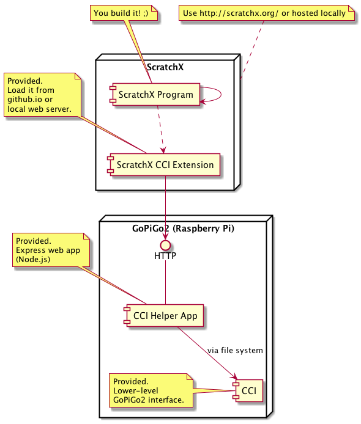

# CCI ScratchX

## How It Works



## Prerequisites

* A running instance of [CCI](https://gitlab.emea.irdeto.com/iaa-hackathon/irdeto-cci)
* [Node.js](https://nodejs.org/en/download/current/)

## Hosted ScratchX and Extension

Extension is available to use with http://scratchx.org via temporary github repo:

http://scratchx.org/?url=https://mikhail-irdeto.github.io/cci.js

Also a sample project is available:

http://scratchx.org/?url=https://mikhail-irdeto.github.io/cci.sbx#scratch

## Local ScratchX and Extension

### Build And Run ScratchX locally
 
See https://github.com/LLK/scratchx 

### Make Extension Available

Run the simple web server to serve the Scratch extension file:

```
cd scratchx
npm install http-server -g
http-server -p 8080
```

### Run ScratchX

When both ScratchX and the extension file server are running (e.g. on `localhost`) load ScratchX with the extension:

http://localhost:8000/?url=http://localhost:8080/cci.js

## Helper App on The GoPiGo2 with CCI 

Clone this repository on the GoPiGo2 

```
cd cci-scratchx/helper-app
npm install npm -g
npm install
```

Make sure CCI is running. Then run the Helper App:

```
npm start -p 8888 -l /tmp/cci/lps -v /tmp/cci/vehicle -c /tmp/cci/compass -m /tmp/cci/map -x /tmp/cci/checkin
```

(assuming CCI is using `/tmp/cci` directory)

### Options

* `--port|-p`       - port for the web server to listen to (default is `8888`)
* `--cciCompass|-c` - filepath of CCI Compass (**required**) 
* `--cciVehicle|-v` - filepath of CCI Vehicle (**required**) 
* `--cciLPS|-l`     - filepath of CCI LPS 
* `--cciMap|-m`     - filepath of CCI Current Map 
* `--cciCheckIn|-x` - filepath for CCI Check-in

## CCI ScratchX Helper App Interface 

### GoPiGo2 State

* `GET /coordinates` 
    Returns current car's coordinates (plain text, space separated), e.g. `124 543`. Requires CCI LPS to be set up.
    
* `GET /heading` 
    Returns car's heading (values from 0 to 360), e.g. `57`.

### Moving GoPiGo2

* `POST /turn?heading={heading}` 
    Turns the car to head the specified direction (if needed) - `north`, `east`, `south`, `west` or the numeric heading (values from 0 to 360), e.g. `57`.
    Does not return anything (empty body). 
    
* `POST /move?duration={duration}&distance={distance}` 
    Moves the car in the current direction for the specified duration (in ms) or for the specified distance (or until stopped using `GET /stop` when neither duration or distance is specified) .
    Does not return anything (empty body).
    
* `POST /stop`
    Stops the car.
    Does not return anything (empty body).

### The "Arena"
 
* `GET /map` 
    Returns the "map" of the part of the "arena" around the car - the 9-elements long space delimited string with the ID of the square where the car is and the IDs of the surrounding squares in the following format: 
    square where the car is, then the square on the car's North, North-East, East, South-East, South, South-West, West, North-West.
    
    E.g. for the following "arena":
    
    ```
    10 11 12
    13 14 15
    16 17 18
    ```
    
    * when the car's position is `13` the map is:
        * `13 10 11 14 17 16 -1 -1 -1` 
    * when car is at `14` the maps is 
        * `14 11 12 15 18 17 16 13 10`
    * etc. The notation `-1` is for the "out-of-arena" regions in that direction.
    
* `POST /checkin`
    Checks in the car at its current position. Returns `1` (success) or `0` (failure) depending on the game schedule and current position and game progress. 

## Scratch How To

See the Scratch [How To Pages](https://wiki.scratch.mit.edu/wiki/Category:How_To_Pages)

For advanced ScratchX information see https://github.com/LLK/scratchx/wiki

## Known Issues

When loading a saved project which was build with the extension hosted locally all the custom blocks appear as `undefined`.
